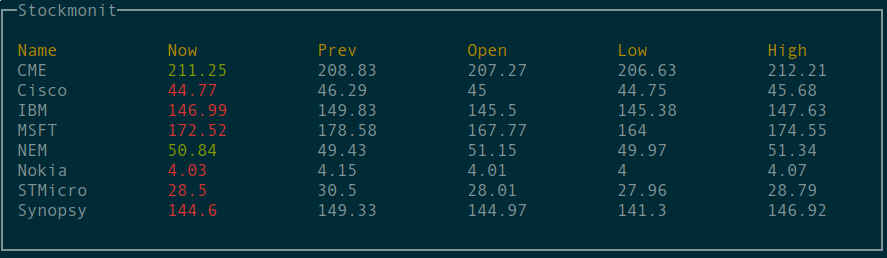

# Stockmonit


Stockmonit is a simple app for monitoring stock prices in your terminal.
It depends on [termbox](https://github.com/nsf/termbox) and [ratatouille](https://hexdocs.pm/ratatouille).



## Installation

```code
$ make install
```

## Tests
```code
$ make test
```

## Running Stockmonit

Make sure you have valid `.stockmonit.json` in your `$HOME` directory and [Finnhub](https://finnhub.io) account configured (or any other stocks API implemented, see below).

```code
$ make run
```

## Usage - keys

`q` - quit.<br/>
`r` - reload all stocks and refresh screen.

## Adding other APIs

Currently `Finnhub` is the only API provider implemented. Adding different providers should be easy - every API adapter needs to be implemented as a`Stockmonit.Api.<ProviderName>` module and has to satisfy `Stockmonit.Api` behavior:

```elixir
  @type response :: {:ok, Quote.t()} | {:error, String.t()}

  @callback url(Stock.symbol(), Stock.api_key()) :: HttpClient.url()
  @callback handler(HttpClient.response()) :: response
```

See [Finnhub](https://github.com/cfx/stockmonit/blob/master/lib/stockmonit/api/finnhub.ex) module as an example.

## Documentation

Generate docs locally via ex_doc:
```code
$ make docs
```

## TODO
- improve TUI
- auto updates based on .stockmonit.json changes.
- custom interval per stock
